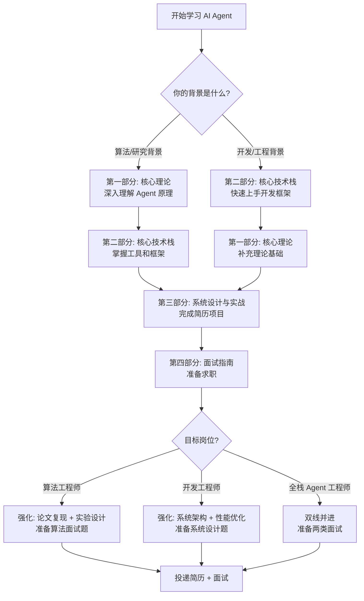

# AgentGuide


<div align="center">
    
    
    
    
<br/>
    
<a href="https://github.com/adongwanai/AgentGuide">
        
    </a>
    <a href="https://github.com/adongwanai/AgentGuide/network/members">
        
    </a>
    
<br/>
    
<h2>🔥 AI Agent 开发 × 面试求职 = 一站式解决方案</h2>
    
<p>
        <strong>一站式 AI Agent 学习指南</strong><br/>
        <strong>从入门到拿 Offer，系统化 + 实战化 + 求职导向</strong>
    </p>
    
<p>
        <a href="#-快速开始"><strong>🚀 10分钟快速上手</strong></a> •
        <a href="#-目录结构"><strong>📚 完整学习路线</strong></a> •
        <a href="#-实战项目"><strong>💼 简历级项目</strong></a> •
        <a href="#-联系作者"><strong>💬 加入学习社群</strong></a>
    </p>
</div>

---

## 📖 关于本项目

> **3 分钟了解为什么你需要 AgentGuide**

### 😰 你是否正在经历这些痛点？

- ❌ **学了一堆 LLM API 调用，但不知道 Agent 和普通对话有什么区别**
- ❌ **看了无数篇 LangChain 文档，却依然不知道从哪里开始**
- ❌ **做了一些 Demo 项目，但简历上写不出亮点，面试讲不清楚**
- ❌ **想转 AI Agent 方向，但不知道算法岗和开发岗应该准备什么**
- ❌ **网上资料又多又杂，缺少一条清晰的学习路线**

### 💡 为什么选择 AgentGuide？

**在大模型时代，AI Agent 正在成为最具商业价值的技术方向：**

| 维度          | 数据/事实                                         |
| :---------- | :-------------------------------------------- |
| 📈 **市场需求** | 2025年秋招，Agent 相关岗位同比增长 **600%+**（数据来源：Boss直聘） |
| 💰 **薪资水平** | Agent 算法工程师平均年薪 **40-100万**，高于传统 NLP/CV 岗位    |
| 🚀 **技术门槛** | **个人可玩转**：一台笔记本 + API 即可开发(算法需要GPU资源)         |
| 🎯 **岗位类型** | **算法岗 + 开发岗双通道**，既可以做创新研究，也可以做工程落地            |
| 🔥 **应用场景** | 智能客服、代码生成、数据分析、研究助手、自动化运维...无处不在              |

**然而，现状是：**
- 📚 **学术论文太多**：ReAct、Reflexion、AutoGPT...论文堆砌，缺少工程实践
- 🧩 **资料过于零散**：LangChain 文档、YouTube 教程、知乎文章...碎片化学习效率低
- ❓ **没有求职导向**：学完了技术，但不知道面试怎么考、简历怎么写

**`AgentGuide` 的定位：**

> **AI Agent 领域的 "JavaGuide"**  
> 系统化、工程化、求职导向的 Agent 学习与面试指南  
> 让每一个想转 Agent 方向的同学，都能找到清晰的成长路径

### 🎯 这份指南适合谁？

- ✅ **算法工程师**：想要将论文里的 Agent 思想落地成可用系统
- ✅ **后端/全栈工程师**：想要转型 AI 赛道，掌握 Agent 开发技能
- ✅ **在校学生**：准备春招/秋招，希望系统准备 AI Agent 相关岗位
- ✅ **AI 爱好者**：想要深入理解 LangGraph、CrewAI、多模态RAG 等核心技术
- ✅ **"通吃"型选手**：既想做算法创新，又想做工程落地的全栈 AI 同学


### 🌟 AgentGuide 的 6 大核心价值

<table>
<tr>
<td width="50%">
📚 系统化学习路径

- ✅ 从零基础到面试通过的完整路线
- ✅ 理论 → 工具 → 实战 → 求职，环环相扣
- ✅ 不用再到处找资料，一个仓库学完全部
</td>
<td width="50%">
 🎯 100% 求职导向
 
- ✅ 每个知识点都标注"面试怎么考"
- ✅ 提供真实大厂面试题
- ✅ 手把手教你如何将项目写进简历
</td>
</tr>
<tr>
<td>
💼 n个简历级实战项目

- ✅ XXXAgent（RAG方向）
- ✅ XXXMulti-Agent（协作方向）
- ✅ XXXAgent（高级方向）
- ✅ 每个项目提供算法岗和开发岗两种写法
</td>
<td>
🔀 算法 × 开发双线通吃

- ✅ 同一项目，可投算法岗或开发岗
- ✅ 算法线：原理、创新、实验设计
- ✅ 开发线：架构、优化、系统设计
</td>
</tr>
<tr>
<td>
🆓 完全开源，持续更新

- ✅ 所有内容永久免费
- ✅ 作者一线大模型算法工程师
- ✅ 社区驱动，欢迎贡献
</td>
<td>
🚀 快速上手，立即见效

- ✅ 10 分钟跑通第一个 Agent
- ✅ 2-3 周完成简历级项目
- ✅ 6-8 周系统掌握，准备面试
</td>
</tr>
</table>

---


### 🎁 学完 AgentGuide，你能获得什么？

> **从迷茫到清晰，从理论到Offer，一站式成长路径**

```
✅ 【概念清晰】深刻理解：Agent 和普通 LLM 调用的本质区别
✅ 【技能掌握】熟练使用：LangChain、Langchain、向量数据库等核心工具  
✅ 【动手能力】独立开发：RAG Agent、Multi-Agent、Web Agent 系统
✅ 【简历亮点】2-3 个可以写进简历、面试能讲清楚的项目
✅ 【面试自信】掌握 Agent 方向的高频面试题和标准答案
✅ 【职业规划】明确算法岗和开发岗的差异，找到适合自己的方向
✅ 【人脉资源】加入 AI Agent 学习社群，结识同行，互相成长
```

---

## 🚦 从零到Offer的完整路径（快速导航）

> **👋 新来的同学看这里！按照这6个步骤，6-8周拿到Offer！**

<table>
<tr>
<td align="center" width="16.6%">

**🎯 第一步**

[确定目标岗位](#-第一步确定你的目标岗位)

算法 vs 开发？

</td>
<td align="center" width="16.6%">

**💡 第二步**

[拿Offer方法论](#-第二步拿offer的方法论)

如何准备？

</td>
<td align="center" width="16.6%">

**📚 第三步**

[学习路线](#-第三步基于岗位的学习路线)

学什么？

</td>
<td align="center" width="16.6%">

**💼 第四步**

[实战项目](#-第四步完成实战项目可写进简历)

做什么？

</td>
<td align="center" width="16.6%">

**🎓 第五步**

[系统学习](#-第五步系统学习-agent-技术技术准备)

技术细节

</td>
<td align="center" width="16.6%">

**🎯 第六步**

[面试冲刺](#-第六步面试准备与-offer-冲刺)

如何面试？

</td>
</tr>
</table>

> **⚡ 重要提醒**：  
> 1. **一定要先完成"第一步"和"第二步"** - 确定方向再学习！  
> 2. **"第四步"实战项目最重要** - 简历的核心竞争力！  
> 3. **学习时对照"第六步"面试题** - 知道学的东西面试怎么考！

---

## 🎯 第一步：确定你的目标岗位

> **核心理念：选择 > 努力！选对方向，事半功倍！**

### 🤔 AI Agent 岗位的两条主线

在大模型时代，Agent 方向的岗位主要分为两条线：

<table>
<tr>
<td width="50%">

### 🔬 **算法工程师线**

**核心工作**：算法创新、论文研究

**日常任务**：
- 读论文、设计算法
- 跑实验、做消融
- 写论文、开源贡献

**产出形式**：
- 论文发表（顶会/期刊）
- 算法库、开源项目
- 专利、技术报告

**评价标准**：
- 算法性能提升（+15%准确率）
- 创新性（新架构、新策略）
- 影响力（论文引用、Star数）

**岗位数量**：⭐⭐⭐ 中等  
**竞争激烈度**：⭐⭐⭐⭐⭐ 很激烈  
**薪资天花板**：⭐⭐⭐⭐⭐ 很高（60-200万）

</td>
<td width="50%">

### 🛠️ **开发工程师线**

**核心工作**：系统搭建、业务落地

**日常任务**：
- 写代码、优化系统
- 对接业务、解决问题
- 性能调优、监控告警

**产出形式**：
- 生产系统上线
- 业务指标提升
- 用户满意度提高

**评价标准**：
- 系统稳定性（P99延迟<500ms）
- 业务价值（成本降低40%）
- 工程能力（QPS、并发、可用性）

**岗位数量**：⭐⭐⭐⭐⭐ 最多  
**竞争激烈度**：⭐⭐⭐ 适中  
**薪资天花板**：⭐⭐⭐⭐ 较高（40-80万）

</td>
</tr>
</table>

### 🎯 你应该选哪条线？

<details>
<summary><b>👉 点击查看详细的岗位选择决策树</b></summary>

<br/>

**问题1：你的核心优势是什么？**

```
├─ 数学/理论强 + 喜欢钻研原理 + 有论文发表
│   → 【算法工程师线】
│   
│   细分方向选择：
│   ├─ 想优化 Agent 算法 → Agent 算法工程师（Memory优化、规划策略）
│   ├─ 想优化 RAG 算法 → RAG 算法工程师（检索策略、Reranker）
│   └─ 想改进模型本身 → 模型算法工程师（Reasoning、对齐）
│
└─ 工程能力强 + 喜欢做系统 + 注重落地
    → 【开发工程师线】
    
    细分方向选择：
    ├─ 想做业务应用 → Agent 应用开发（RAG系统、RPA、智能客服）⭐ 推荐
    ├─ 想做基础设施 → AI Infra 开发（推理部署、训练平台）
    └─ 想做产品化 → AI 应用开发（前端集成、产品化）
```

**问题2：有什么背景？**

- ✅ **有论文/科研经历** → 优先算法线
- ✅ **有工程/项目经验** → 优先开发线
- ✅ **两者都有** → **通吃策略**（最推荐！）

**⭐ 最佳策略：两手抓！**
- 简历中既有算法项目（论文、算法优化）
- 又有开发项目（完整系统、业务指标）
- 可以同时投两类岗位，机会翻倍！

详细对比见：[转行大模型热门方向准备指南](./docs/04-interview/06-career-transition.md)

</details>

---

## 💡 第二步：拿Offer的方法论

> **不同岗位，完全不同的准备策略！**

### 🔬 算法工程师 - 如何准备？

<details>
<summary><b>点击查看算法岗完整准备方案</b></summary>

<br/>

**简历重点**：

✅ **必须强调**：
- **算法创新**："提出XX算法"、"改进XX方法"、"设计XX策略"
- **实验验证**：对比实验、消融实验、baseline对比、指标提升
- **论文/专利**："论文在投XXX"、"发表于XXX"
- **开源贡献**："开源代码XX stars"

❌ **尽量少提**：
- 业务指标（用户数、QPS）
- 系统架构细节
- 工程优化

**项目示例（算法岗）**：
```
【Agentic RAG 策略优化】
- 问题：多跳推理场景召回率低（实验测得62%）
- 方法：提出基于RL的子图采样算法，优化路径排序策略
- 实验：在KGQA数据集上F1提升12%，对比5种baseline
        消融实验：RL策略贡献8%，路径排序贡献4%
- 产出：论文在投EMNLP（一作），代码开源300+ stars
- 技能：强化学习、图神经网络、知识图谱
```

**面试准备重点**：
- 📚 理论深度（能推导算法原理）
- 🧪 实验设计（对比实验、消融实验）
- 📄 论文阅读（顶会最新进展）
- 💻 代码实现（能手撕核心算法）

</details>

### 🛠️ 开发工程师 - 如何准备？

<details>
<summary><b>点击查看开发岗完整准备方案</b></summary>

<br/>

**简历重点**：

✅ **必须强调**：
- **完整系统**："搭建XX系统"、"端到端实现"、"上线服务"
- **业务价值**：服务用户数、处理量、业务指标提升
- **性能优化**：QPS提升、延迟降低、成本节省
- **技术栈**：具体框架、工具、数据库、部署方案
- **工程能力**：高并发、高可用、监控告警

❌ **不要过度强调**：
- 算法细节和理论推导
- 论文（开发岗更看重系统）

**项目示例（开发岗）**：
```
【企业级 Agent 自动化系统】
- 背景：客服部门日均5000+重复工单，人力成本高
- 技术：LangChain + WebShaper + Mem0
        多Agent协同（规划Agent、执行Agent、审核Agent）
        集成20+工具（数据库、API、浏览器操作）
- 优化：异常重试机制，成功率从70%→95%
        并发处理，吞吐量提升5倍
- 成果：自动化率80%，效率提升3倍
        节省人力成本200万/年，获部门最佳项目奖
- 技能：Agent开发、工具集成、系统监控
```

**面试准备重点**：
- 🏗️ 系统设计（高可用、高并发）
- ⚡ 性能优化（缓存、批处理）
- 🔧 工程实践（部署、监控、异常处理）
- 💼 业务理解（为什么这样设计）

</details>

### 🔀 通吃策略 - 如何准备？（⭐ 最推荐）

<details>
<summary><b>点击查看"通吃"完整准备方案</b></summary>

<br/>

**为什么推荐通吃？**
1. **机会翻倍**：可同时投算法和开发岗
2. **展现全栈**：大模型时代，算法+工程都重要
3. **灵活适配**：大厂偏算法，创业公司偏工程

**理想简历结构（3-4个项目）**：
```
项目1：算法创新型 🔬
  → 体现算法能力：Agent Memory优化 / Agentic RAG策略
  → 关键词：论文、实验、开源
  
项目2：系统落地型 🛠️
  → 体现工程能力：完整RAG系统 / Multi-Agent应用
  → 关键词：业务指标、性能优化、上线
  
项目3：微调/训练型（加分项）
  → 体现训练能力：Function Call微调 / RLHF
  → 关键词：多少卡、参数设置、训练稳定性
```

**AgentGuide 的学习路径**：
1. 先学理论（第一部分）- 建立算法认知
2. 再学工具（第二部分）- 掌握工程技能
3. 做实战项目（第三部分）- 同时准备算法版和开发版
4. 面试准备（第四部分）- 掌握两类面试技巧

</details>

---

## 📚 第三步：基于岗位的学习路线

> **根据你在"第一步"的选择，选择对应的学习路线**

### 🗺️ 选择你的学习路线

<table>
<tr>
<td width="50%" align="center">

### 🔬 **算法岗学习路线**

**学习时长**：6-8 周  
**难度**：⭐⭐⭐⭐⭐  
**产出**：论文 + 开源项目

**学习重点**：
- 📚 理论深度（能推导公式）
- 🧪 实验设计（对比、消融）
- 📄 论文阅读（顶会前沿）
- 💻 算法实现（手撕核心）

**项目类型**：
- Agentic RAG 策略优化
- Agent Memory 压缩算法
- Multi-Agent 协作策略

<br/>

**👉 [查看详细路线图](./docs/learning-roadmap-algorithm.md)**

</td>
<td width="50%" align="center">

### 🛠️ **开发岗学习路线**

**学习时长**：4-6 周  
**难度**：⭐⭐⭐  
**产出**：完整系统 + 业务指标

**学习重点**：
- 🏗️ 系统设计（架构、扩展性）
- ⚡ 性能优化（缓存、批处理）
- 🔧 工程实践（部署、监控）
- 💼 业务理解（痛点、价值）

**项目类型**：
- 企业级 RAG 系统
- Agent 自动化系统
- Multi-Agent 协作应用

<br/>

**👉 [查看详细路线图](./docs/learning-roadmap-development.md)**

</td>
</tr>
</table>

---

### 📊 两条线对比速览

| 维度 | 🔬 算法岗 | 🛠️ 开发岗 |
|:---|:---|:---|
| **学习重点** | 理论+实验 | 框架+系统 |
| **时间投入** | 6-8周 | 4-6周 |
| **难度** | 较难 | 适中 |
| **简历核心** | 论文、算法优化 | 完整系统、业务指标 |
| **面试重点** | 算法原理、实验设计 | 系统设计、性能优化 |
| **职业路径** | 研究员、算法专家 | 技术专家、架构师 |

> **💡 提示**：不确定选哪个？建议先看 [第一步：岗位选择](#-第一步确定你的目标岗位)

---

### 🗺️ 通用学习流程图



### ⏱️ 学习时间概览

| 学习路线 | 时长 | 每日投入 | 适合人群 |
|:---|:---:|:---:|:---|
| **🔬 算法岗路线** | 6-8周 | 2-3小时 | 有科研背景，想做创新 |
| **🛠️ 开发岗路线** | 4-6周 | 2-4小时 | 有工程背景，想做落地 |
| **🚀 快速通道** | 2-3周 | 3-4小时 | 有AI基础，快速上手 |

> **💡 建议**：点击上面的"查看详细路线图"，获取**每日学习计划**和**详细任务清单**

---

## 💼 第四步：完成实战项目（可写进简历）

> **这是最重要的一步！没有项目，一切都是空谈！**

AgentGuide 提供 **3 个简历级实战项目**，每个项目都提供：
- ✅ 完整的代码实现
- ✅ 系统架构设计
- ✅ **算法岗和开发岗两种简历写法**
- ✅ 面试时如何讲解

**👉 直接跳转到实战项目**：[点击这里查看3个项目](#32-简历级实战项目-)

---

## 🎓 第五步：系统学习 Agent 技术（技术准备）

> **基于你选择的岗位，有针对性地学习相关技术**

### 📚 完整知识体系

### 📖 第一部分：AI Agent 核心理论（基石篇）

> 💡 **学习目标**：理解 Agent 的本质，掌握主流架构思想  
> 🔬 **算法岗重点**：深入理解原理，能推导公式  
> 🛠️ **开发岗建议**：理解概念即可，快速过一遍

#### 1.1 Agent 基础概念入门
- [ ] [必看👍 到底什么是 AI Agent？图文详解](./docs/01-theory/01-what-is-agent.md)
- [ ] [核心组件详解：Planning、Memory、Tool Use](./docs/01-theory/02-core-components.md)
- [ ] [Agent 与 RAG 的关系](./docs/01-theory/03-agent-vs-rag.md)

#### 1.2 主流 Agent 架构思想
- [ ] [必看👍 ReAct 框架思想详解](./docs/01-theory/04-react-framework.md)
- [ ] [思维链 (Chain-of-Thought, CoT) 与 Agent 规划](./docs/01-theory/05-cot-and-planning.md)
- [ ] [高阶架构：Tree of Thoughts, Self-Correction, Self-Consistency](./docs/01-theory/06-advanced-architectures.md)
- [ ] [多智能体系统 (Multi-Agent) 入门](./docs/01-theory/07-multi-agent-intro.md)

#### 1.3 Agent 评估与基准
- [ ] [AgentBench：主流 Agent 评测框架介绍](./docs/01-theory/08-agent-bench.md)
- [ ] [如何科学评估 Agent 性能？](./docs/01-theory/09-evaluation-metrics.md)

---

### 🛠️ 第二部分：核心技术栈与框架（工具篇）

> 💡 **学习目标**：掌握 Agent 开发的核心工具链，快速搭建原型系统  
> 🔬 **算法岗重点**：理解框架原理，必要时能魔改源码  
> 🛠️ **开发岗重点**：熟练使用框架，快速实现功能

#### 2.1 大语言模型 (LLMs) - Agent 的大脑
- [ ] [主流 LLM API 对比与选型](./docs/02-tech-stack/01-llm-api-comparison.md)
- [ ] [开源 LLM 本地部署与调用](./docs/02-tech-stack/02-open-source-llm.md)
- [ ] [Fine-tuning 入门：什么时候需要微调？](./docs/02-tech-stack/03-llm-finetuning.md)

#### 2.2 Agent 开发框架（必看👍）
- [ ] [必看👍 LangChain 核心概念与实战](./docs/02-tech-stack/04-langchain-guide.md)
- [ ] [LlamaIndex 核心概念与实战](./docs/02-tech-stack/05-llamaindex-guide.md)
- [ ] [AutoGen/CrewAI 多智能体框架详解](./docs/02-tech-stack/06-multi-agent-frameworks.md)
- [ ] [框架选型对比：何时用 LangChain vs LlamaIndex](./docs/02-tech-stack/07-framework-comparison.md)

#### 2.3 向量数据库 - Agent 的记忆
- [ ] [必看👍 向量数据库基础：Embedding 与向量检索](./docs/02-tech-stack/08-vector-db-basics.md)
- [ ] [主流向量数据库对比与实战](./docs/02-tech-stack/09-vector-db-comparison.md)
- [ ] [RAG 检索策略详解：从基础到 HyDE、Rerank、Query Expansion](./docs/02-tech-stack/10-rag-strategies.md)

#### 2.4 工具 (Tools) - Agent 的双手
- [ ] [API 工具：让 Agent 调用外部服务](./docs/02-tech-stack/11-api-tools.md)
- [ ] [代码解释器 (Code Interpreter)：原理与实现](./docs/02-tech-stack/12-code-interpreter.md)
- [ ] [网络浏览 (Web Browsing)：原理与实现](./docs/02-tech-stack/13-web-browsing.md)

---

### 🚀 第三部分：系统设计与实战（应用篇）

> 💡 **学习目标**：从玩具到产品，完成可写进简历的项目  
> 🔬 **算法岗重点**：实验设计、评估体系、算法优化  
> 🛠️ **开发岗重点**：系统架构、性能优化、生产部署

#### 3.1 Agent 系统设计
- [ ] [必看👍 Agent 系统设计面试题总结](./docs/03-practice/01-system-design-interview.md)
- [ ] [如何设计一个高可用的 RAG 系统？](./docs/03-practice/02-high-availability-rag.md)
- [ ] [Agent 安全性：Prompt 注入、权限控制、数据隐私](./docs/03-practice/03-agent-security.md)
- [ ] [Agent 可观测性：监控、调试与追踪](./docs/03-practice/04-observability.md)

#### 3.2 简历级实战项目 🚀

> **每个项目都提供完整代码 + 算法岗/开发岗双版本简历写法**

<details>
<summary><b>📄 项目一：自动化论文检索与分析 Agent（⭐ 推荐新手）</b></summary>

<br/>

**项目核心**：为研究人员打造智能论文分析助手，整合 ArXiv 检索、多跳推理、自主规划等核心技术

**适合场景**：
- ✅ 面试 RAG 相关岗位（检索增强生成）
- ✅ 展示 Agentic 思维和系统设计能力
- ✅ 零基础友好，2-3周可完成

**你将获得的核心能力**：

<table>
<tr>
<td width="50%">

**🔬 算法线能力**
- Agentic RAG 策略设计
- 多跳推理算法实现
- 检索召回率优化（65% → 85%）
- 消融实验设计与分析

</td>
<td width="50%">

**🛠️ 工程线能力**
- 端到端 RAG 系统搭建
- Redis 缓存优化（降低70%成本）
- LangSmith 链路追踪集成
- 高可用架构设计

</td>
</tr>
</table>

**技术栈**：LangChain + Milvus + ArXiv API + GPT-4 + Redis

**学习路径**：
- [ ] [项目需求与技术选型](./projects/01-paper-agent/01-requirements.md)
- [ ] [系统架构设计](./projects/01-paper-agent/02-architecture.md)
- [ ] [核心代码实现](./projects/01-paper-agent/03-implementation.md)
- [ ] [部署与演示](./projects/01-paper-agent/04-deployment.md)
- [ ] [📝 如何写进简历？（算法岗 vs 开发岗）](./projects/01-paper-agent/05-resume-guide.md)

**📝 简历示例**

<table>
<tr>
<td width="50%">

**算法岗写法**：
```
【Agentic RAG 策略优化】
- 问题：传统RAG召回率仅65%
- 方法：基于ReAct框架设计自主
  规划检索策略，引入多跳推理
- 实验：召回准确率提升至85%
  消融实验：规划策略贡献12%
- 产出：论文在投，代码开源
```

</td>
<td width="50%">

**开发岗写法**：
```
【高可用论文分析系统】
- 背景：研究员日均检索50+论文
- 技术：LangChain + Milvus + Redis
  混合检索策略 + 缓存优化
- 优化：P99延迟2s→300ms
  API成本降低70%
- 成果：服务20+研究员，日均
  500+查询，满意度95%
```

</td>
</tr>
</table>

</details>

<details>
<summary><b>🌍 项目二：旅行规划 Multi-Agent 系统（⭐ 适合展示协作能力）</b></summary>

<br/>

**项目核心**：打造智能旅行助手，通过多Agent协作实现从需求分析到行程规划的完整闭环

**适合场景**：
- ✅ 面试 Multi-Agent 协作岗位
- ✅ 展示复杂任务分解与Agent编排能力
- ✅ 中等难度，适合有一定基础的同学

**你将获得的核心能力**：

<table>
<tr>
<td width="50%">

**🔬 算法线能力**
- Multi-Agent 协作策略设计
- 任务分解与规划算法
- Agent 通信协议优化
- 共识机制与冲突解决

</td>
<td width="50%">

**🛠️ 工程线能力**
- AutoGen/CrewAI 框架实战
- 多API集成与编排
- 异步任务处理与并发控制
- 分布式 Agent 系统设计

</td>
</tr>
</table>

**技术栈**：AutoGen / CrewAI + 天气API + 航班API + 酒店API + GPT-4

**项目亮点**：
- ✅ 3 个专业 Agent 协同工作（需求分析师、预算规划师、行程执行者）
- ✅ 层级式通信：Supervisor 模式 + 消息队列
- ✅ 智能决策：预算超支自动调整、天气影响行程变更

**学习路径**：
- [ ] [项目需求与技术选型](./projects/02-travel-agent/01-requirements.md)
- [ ] [系统架构设计](./projects/02-travel-agent/02-architecture.md)
- [ ] [核心代码实现](./projects/02-travel-agent/03-implementation.md)
- [ ] [部署与演示](./projects/02-travel-agent/04-deployment.md)
- [ ] [📝 如何写进简历？（算法岗 vs 开发岗）](./projects/02-travel-agent/05-resume-guide.md)

</details>

<details>
<summary><b>🕷️ 项目三：Web Agent - 自主浏览与任务完成（⭐ 高级，适合冲刺大厂）</b></summary>

<br/>

**项目核心**：打造能自主浏览网页、理解页面内容、完成复杂任务的智能Agent（如在线购物、表单填写）

**适合场景**：
- ✅ 面试顶级 Agent 岗位（字节、阿里等）
- ✅ 展示视觉理解 + 决策执行的完整能力
- ✅ 高级项目，适合冲刺大厂SP/SSP

**你将获得的核心能力**：

<table>
<tr>
<td width="50%">

**🔬 算法线能力**
- 视觉-语言多模态理解
- 强化学习策略优化
- 自我修正与反思机制
- Benchmark评估（WebArena）

</td>
<td width="50%">

**🛠️ 工程线能力**
- Playwright 浏览器自动化
- GPT-4V 视觉理解集成
- 异常处理与重试机制
- 复杂工作流编排

</td>
</tr>
</table>

**技术栈**：Playwright + GPT-4V + LangChain + 强化学习（PPO）

**项目亮点**：
- ✅ 视觉理解 + 操作执行的完整闭环
- ✅ 基于反馈的自我修正机制（识别错误 → 分析原因 → 调整策略）
- ✅ 在 WebArena 基准测试上达到 75% 成功率（超越 Baseline 10%）

**学习路径**：
- [ ] [项目需求与技术选型](./projects/03-web-agent/01-requirements.md)
- [ ] [系统架构设计](./projects/03-web-agent/02-architecture.md)
- [ ] [核心代码实现](./projects/03-web-agent/03-implementation.md)
- [ ] [部署与演示](./projects/03-web-agent/04-deployment.md)
- [ ] [📝 如何写进简历？（算法岗 vs 开发岗）](./projects/03-web-agent/05-resume-guide.md)

</details>

---

### 💼 第六步：面试准备与 Offer 冲刺

> 💡 **学习目标**：系统准备面试，提升 Offer 成功率  
> 📝 **两条线不同的面试策略**：算法岗讲创新，开发岗讲价值

#### 4.1 AI Agent 面试题库
- [ ] [必看👍 理论篇：高频概念题](./docs/04-interview/01-theory-questions.md)
- [ ] [必看👍 系统设计篇：经典设计题](./docs/04-interview/02-system-design-questions.md)
- [ ] [必看👍 编程篇：手撕代码题](./docs/04-interview/03-coding-questions.md)

#### 4.2 求职准备
- [ ] [AI Agent 学习路线图（本文档）](./README.md)
- [ ] [简历编写指南：如何突出 Agent 项目](./docs/04-interview/04-resume-guide.md)
- [ ] [算法岗 vs 开发岗：如何讲好你的项目故事](./docs/04-interview/05-storytelling.md)
- [x] [⭐ 转行大模型热门方向准备指南](./docs/04-interview/06-career-transition.md)
- [x] [⭐ 如何准备大模型秋招完整攻略](./docs/04-interview/07-job-hunting-guide.md)

#### 4.3 核心资源精选（只推荐最重要的）

**Agent 方向核心资源**：
- [x] [⭐ AI Agent 开发框架推荐](./resources/frameworks.md) - 7个核心框架对比
- [x] [⭐ Awesome Agent 资源精选](./resources/awesome-agent.md) - Agent 开发必备
- [x] [⭐ Awesome RAG 资源精选](./resources/awesome-rag.md) - RAG 技术栈
- [x] [⭐ AI Agent 开发者工具箱](./resources/tools.md) - 效率工具推荐

**更多资源查询**：
- [ ] [必读论文清单](./resources/papers.md) - 20-30篇核心论文
- [ ] [优质博客与教程](./resources/blogs.md) - 学习资源推荐

**🌟 需要更全面的 LLM 资源？**  
👉 查看作者的另一个项目：**[Awesome-Awesome-LLM](https://github.com/adongwanai/Awesome-Awesome-LLM)**  
（涵盖训练、推理、多模态、Infra 等 LLM 全栈 200+ Awesome 系列资源）

---

## 🚀 快速开始

### 1️⃣ 如果你是算法背景（10 分钟快速入门）

```bash
# 第一步：理解 Agent 是什么
阅读：docs/01-theory/01-what-is-agent.md

# 第二步：学习核心框架 ReAct
阅读：docs/01-theory/04-react-framework.md

# 第三步：快速上手 LangChain
阅读：docs/02-tech-stack/04-langchain-guide.md

# 第四步：跑通第一个 Agent
git clone https://github.com/adongwanai/AgentGuide.git
cd AgentGuide/examples
python quickstart_agent.py
```

### 2️⃣ 如果你是开发背景（10 分钟快速入门）

```bash
# 第一步：快速上手 LangChain
阅读：docs/02-tech-stack/04-langchain-guide.md

# 第二步：理解 Agent 核心概念
阅读：docs/01-theory/01-what-is-agent.md

# 第三步：学习向量数据库
阅读：docs/02-tech-stack/08-vector-db-basics.md

# 第四步：搭建第一个 RAG Agent
git clone https://github.com/adongwanai/AgentGuide.git
cd AgentGuide/examples
python quickstart_rag_agent.py
```

---

## 🤝 如何贡献

`AgentGuide` 是一个完全开源的项目，非常欢迎你的贡献！

### 贡献方式

1. **内容贡献**：完善文档、补充案例、纠正错误
2. **代码贡献**：优化示例代码、添加新的实战项目
3. **翻译贡献**：帮助翻译成英文版，让更多人受益
4. **问题反馈**：发现问题？请提 Issue

### 贡献流程

1. Fork 本仓库
2. 创建你的特性分支 (`git checkout -b feature/AmazingFeature`)
3. 提交你的修改 (`git commit -m 'Add some AmazingFeature'`)
4. 推送到分支 (`git push origin feature/AmazingFeature`)
5. 提交 Pull Request

详细贡献指南请参考：[CONTRIBUTING.md](./CONTRIBUTING.md)

---

## 📬 联系作者 & 加入社群

### 👨‍💻 关于作者

我是**阿东**，一线大模型算法工程师

- 🎓 **技术背景**：专注 AI、RAG、LLM 应用方向
- 📝 **内容创作**：全网 15000+ 粉丝，持续分享 AI 技术与求职经验
- 🚀 **开源贡献**：多个 AI 相关开源项目维护者

### 🌐 在这些平台找到我

<table>
<tr>
<td align="center" width="25%">
<strong>📱 小红书</strong><br/>
<a href="https://www.xiaohongshu.com/user/profile/5f310fd50000000001009df5"><code>阿东玩AI</code></a><br/>
<sub>短视频教程 + 技术拆解</sub>
</td>
<td align="center" width="25%">
<strong>📝 公众号</strong><br/>
<a href="https://mp.weixin.qq.com/s/u_UFh0l8clzaPLyp2_LEnQ"><code>阿东玩AI</code></a><br/>
<sub>深度技术文章 + 求职经验</sub>
</td>
<td align="center" width="25%">
<strong>🎬 B站</strong><br/>
<a href="https://space.bilibili.com/297247087"><code>阿东玩AI</code></a><br/>
<sub>视频教程 + 项目实战</sub>
</td>
<td align="center" width="25%">
<strong>💻 GitHub</strong><br/>
<a href="https://github.com/adongwanai"><code>@adongwanai</code></a><br/>
<sub>开源项目 + 代码示例</sub>
</td>
</tr>
</table>

### 💬 加入 AI Agent 学习社群

**为什么要加入社群？**

- ✅ **每周技术分享**：Agent 最新论文解读、工程实践经验
- ✅ **简历面试辅导**：免费简历诊断、模拟面试、内推机会
- ✅ **问题实时答疑**：技术问题、求职困惑，随时提问
- ✅ **学习小组**：组队学习 AgentGuide，互相监督，共同进步
- ✅ **行业资源**：大厂内推信息、技术资料、论文分享

**如何加入？**

1. **方式一**：Star 本项目后，在 [Issues](https://github.com/adongwanai/AgentGuide/issues) 中评论"申请加群"
2. **方式二**：关注公众号「阿东玩AI」，回复「AgentGuide」获取入群二维码
3. **方式三**：[小红书@阿东玩AI](https://www.xiaohongshu.com/user/profile/5f310fd50000000001009df5)，私信"加群"

**🎁 社群福利**：Agent 学习路线图 PDF + 面试题库 + 项目代码模板 + 大厂内推机会

---

### ⭐ 如果这个项目对你有帮助

**请考虑支持一下：**

- ⭐ **Star** 本仓库，让更多人看到
- 🔀 **Fork** 本仓库，开始你的学习之旅
- 📣 **分享** 给正在找 AI 工作的朋友
- 💬 **反馈** 你的建议和意见（提 Issue 或 PR）

**你的每一个 Star 都是我持续更新的动力！🚀**

---

## ❓ 常见问题 FAQ

<details>
<summary><b>Q1: 我没有 AI 基础，能学会吗？</b></summary>

<br/>

**A**: 可以！AgentGuide 从零开始，会介绍必要的基础知识。但建议：
- 有基础的 Python 编程能力
- 了解基本的机器学习概念（不强制）
- 使用过 ChatGPT 等 LLM 产品

如果完全零基础，建议先学习：
1. Python 基础（菜鸟教程即可）
2. 了解什么是大语言模型（看 1-2 篇科普文章）

</details>

<details>
<summary><b>Q2: 学完大概需要多长时间？</b></summary>

<br/>

**A**: 取决于你的目标和基础：
- **快速上手**（有基础）：2-3 周，完成 1 个项目，能投简历
- **系统学习**（零基础）：6-8 周，完成 2-3 个项目，充分准备面试
- **深入掌握**（想做顶尖）：3-4 个月，完成所有项目 + 论文复现

</details>

<details>
<summary><b>Q3: 算法岗和开发岗有什么区别？我该选哪个？</b></summary>

<br/>

**A**: 核心区别：
- **算法岗**：侧重创新、优化、实验设计。需要论文、理论深度。薪资天花板更高，但竞争激烈。
- **开发岗**：侧重系统、工程、性能优化。需要项目经验、系统设计能力。岗位更多，相对好进。

**如何选择**：
- 有论文/科研经历 → 优先算法岗
- 工程背景/项目经验丰富 → 优先开发岗
- 想"通吃" → 学习 AgentGuide 的双线方法

详细对比见：[算法岗 vs 开发岗](./docs/04-interview/06-career-transition.md)

</details>

<details>
<summary><b>Q4: AgentGuide 和其他教程有什么不同？</b></summary>

<br/>

**A**: 核心差异：
1. **求职导向**：不只教技术，更教你如何拿 Offer
2. **系统化**：完整学习路径，不是碎片化资料堆砌
3. **双线并进**：同时适合算法岗和开发岗
4. **实战项目**：提供可直接写进简历的项目
5. **持续更新**：作者是一线从业者，紧跟技术前沿

</details>

<details>
<summary><b>Q5: 我可以商业使用 AgentGuide 的内容吗？</b></summary>

<br/>

**A**: 个人学习和求职完全免费。但请注意：
- ✅ **允许**：用于个人学习、求职简历、面试准备
- ✅ **允许**：在自己的博客/公众号分享（需注明来源）
- ❌ **不允许**：未经许可的商业培训、课程销售
- ❌ **不允许**：去除作者信息后的二次分发

详见 [LICENSE](./LICENSE)

</details>

---

<div align="center">
    <br/>
    <h2>🚀 开始你的 AI Agent 学习之旅吧！</h2>
    <p>
        <strong>从这一刻起，距离你拿到 AI Agent Offer 只有 6-8 周</strong>
    </p>
    <br/>
    <p>
        <a href="#-快速开始"><strong>👉 点击这里，10分钟快速上手 👈</strong></a>
    </p>
    <br/>
    <p>
        ⭐⭐⭐ 如果觉得有帮助，请给个 Star！⭐⭐⭐
    </p>
    <p>
        <sub>你的 Star 是我持续更新的最大动力</sub>
    </p>
    <br/>
    <p>
        <strong>转行大模型，看阿东玩AI</strong>
    </p>
    <br/>
</div>
